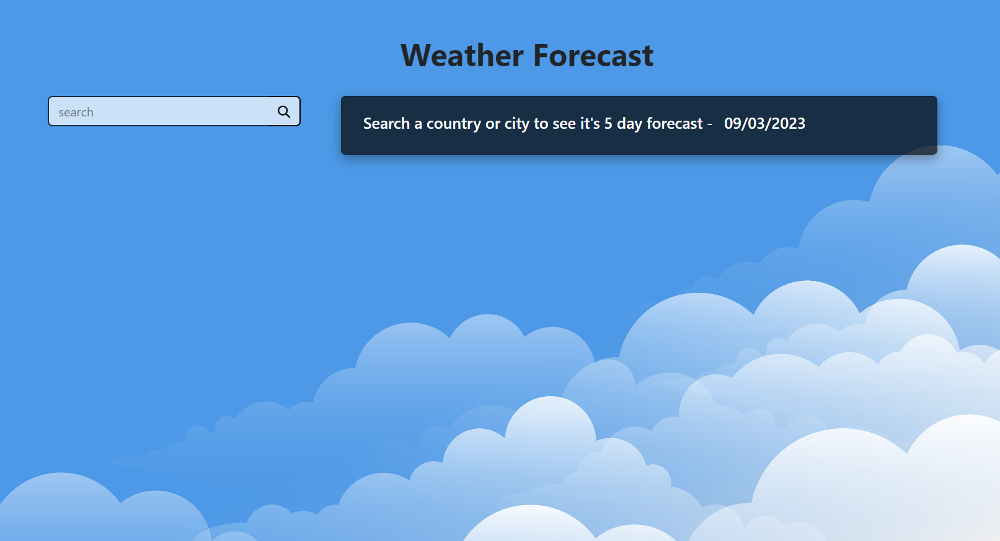
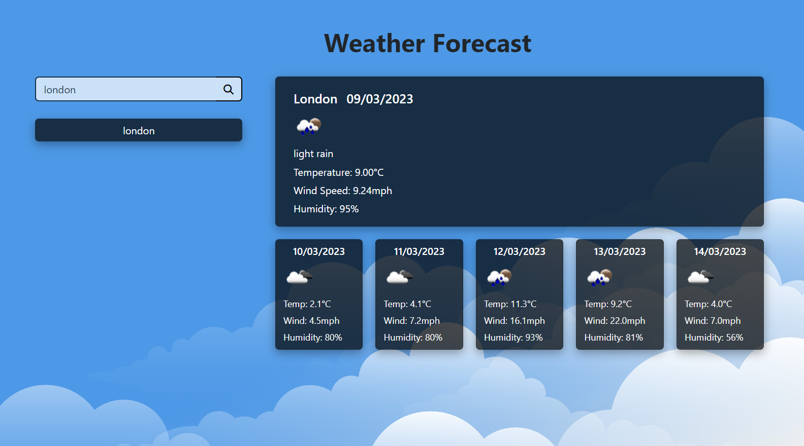

# Weather App

This is a weather app built using the OpenWeather API. It allows users to search for weather information of any city in the world. As well, recent user searches are saved and can be clicked on to be recalled.

## Features

- Users can search for weather information of any city in the world
- Weather information displayed includes temperature, humidity, and wind speed
- Recent location data searched is saved and can be clicked on and recalled

## How to Use

1. Enter the name of the city you want to get weather information for in the search box and click the "Search" button.
2. The weather information for the city will be displayed on the screen.

## Mock Up

The landing page when the site is opened will look like this: 

when a location is searched, the page will look like this: 

## Technologies Used

- HTML
- CSS
- JavaScript
- OpenWeather API

## Demo

You can see a live demo of the app [here](https://darylbg.github.io/weather-app/).
The source code can be found [here](https://github.com/darylbg/weather-app).
